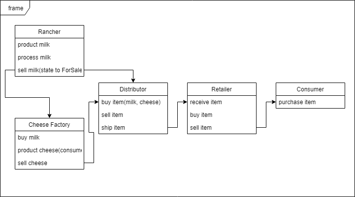
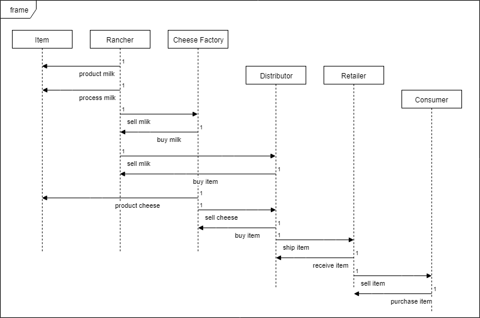
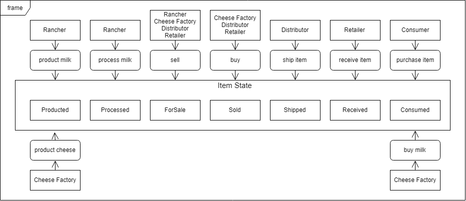
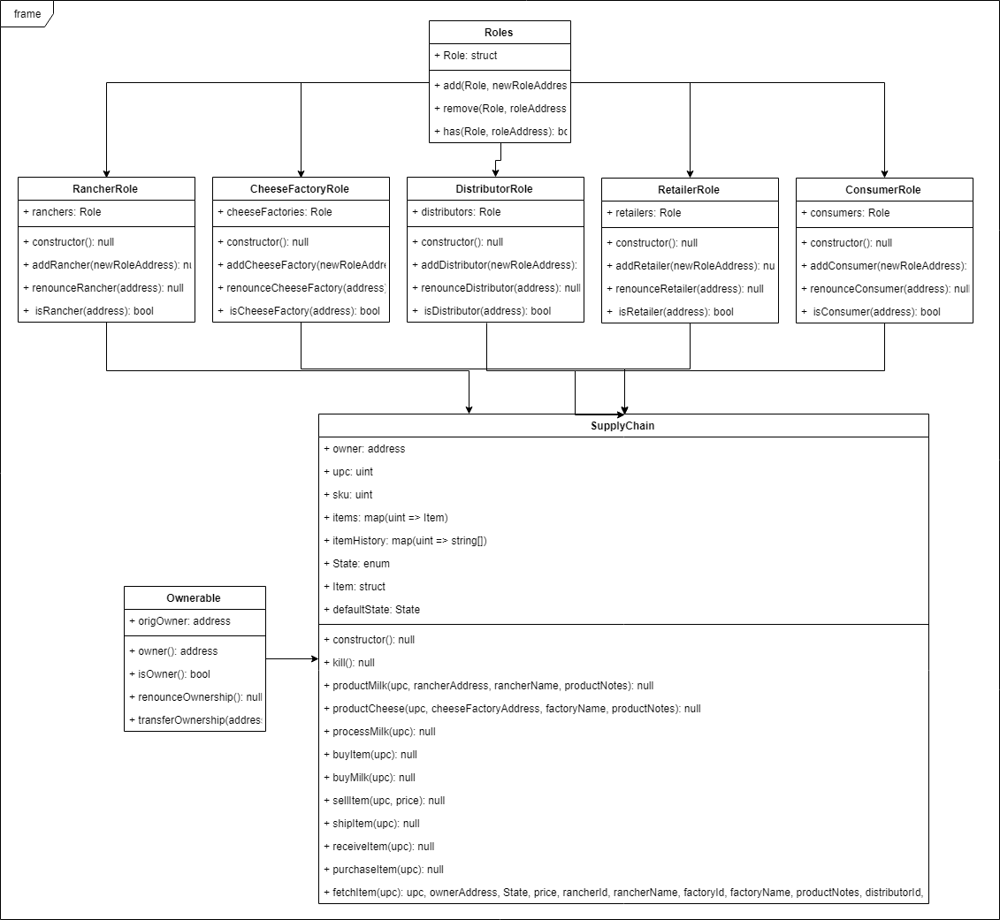

# milk_supply_chain
Supply Chain Dapp based on Ethereum Blockchain network.

## Getting Started

- Using this application, it is possible to connect members between supply chain. You can refer to the UML images below. Main actors are rancher, cheese factory, distributor, retailer and consumer.
- You can join this chain with your rinkeby testnet account or deploy a new contract.
- This project is a task in Udacity Blockchain Developer Nanodegree Program. 
- This project is constructed based on truffle Webpack box. You can see Webpack [here](https://www.trufflesuite.com/boxes/webpack).
- Please reter to write-up.txt if you want to know specific deployed contract information.






## Prerequisites
Please refer to write-up.txt. It contains specific versions.
- node.js v10.15.3
- truffle v5.0.26
- metamask v6.7.2

#### At windows OS
You may have to install 'window-build-tools' to build this project on Windows OS.
```
npm install -g node-gyp
```
```
npm install --global --production windows-build-tools
```
If it doesn't work, please refer to [here](https://github.com/nodejs/node-gyp).

## Installing

modules that you have to install are saved on package.json
So, what you need to do is
```
npm install
```

## Running the tests

Turn on your terminal and move to the project folder first.
```
truffle develop
```
```
compile
```
```
migrate --reset
```
Then, turn on another terminal. Move to the project folder.
```
cd app
```
```
npm run dev
```
Finally, you can use the starNotary test service on browser.
```
http://localhost:8080
```

## Deployment

You can deploy starNotary contract on Ethereum testnet environment.
 - before using the service, you have to have your account on rinkeby network. The best way to generate account and use service is via using metamask.
 - In addition, you have to modify truffle-config.js.
```
//in truffle-config.js
const infuraKey = "your Infura Project ID";
const mnemonic = 'your rinkbey private key';
```
```
npm install --save truffle-hdwallet-provider
```
```
truffle migrate --reset --network rinkeby
```

## Built With

* [Ethereum](https://www.ethereum.org/) - Ethereum is a decentralized platform that runs smart contracts
to make the web faster, safer, and more open.
* [Truffle Framework](http://truffleframework.com/) - Truffle is the most popular development framework for Ethereum with a mission to make your life a whole lot easier.

## Acknowledgments

* Solidity
* Ganache-cli
* Truffle